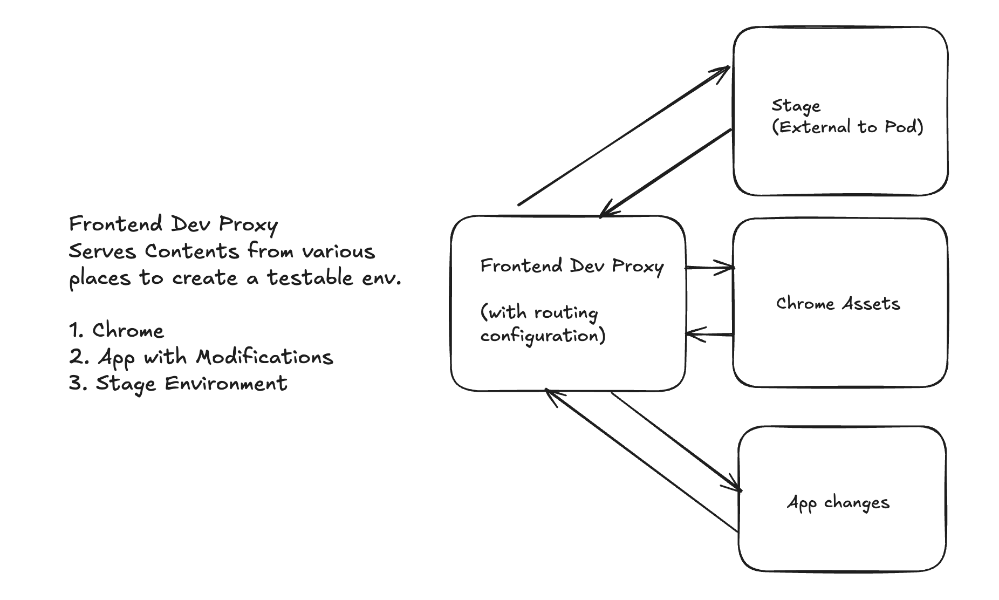

# Reusable E2E Test Pipeline (Playwright)

This document provides a conceptual overview of the reusable E2E test pipeline for Playwright-based testing. It explains the architecture, approach, and key concepts behind running full-flow end-to-end tests in PR pipelines. For detailed implementation steps and configuration examples, see the [Setup Guide](https://docs.google.com/document/d/1JnOJ5w4Q-OW3vlvHhTxhzOep6A2sveJYWQrX-HOH280/edit?usp=sharing).

**Target Audience:** Developers evaluating whether to adopt this pipeline for their repository, or team members seeking to understand how the E2E testing infrastructure works.

---

End-to-End Playwright tests are configured to run in the PR pipeline for the following repositories at time of writing.

* insights-chrome
* learning-resources
* frontend-starter-app [in progress]

As we expand our E2E test coverage with Playwright, more repositories will join the list.

---

## Quick Reference

**Getting Started:**
- **[Setup Guide](https://docs.google.com/document/d/1JnOJ5w4Q-OW3vlvHhTxhzOep6A2sveJYWQrX-HOH280/edit?usp=sharing)** - Complete implementation guide for adding the pipeline to your repository
- **[NotebookLM Q&A](https://notebooklm.google.com/notebook/7a32f12f-9b07-4cb3-b966-3af6caad5d86)** - AI assistant for pipeline-related questions

**Additional Resources:**
- [Platform Experience Testing Strategy](testing-strategy.md) - Broader testing philosophy and approach
- Contact: Platform Experience UI team on Slack (`@platform-experience-ui` in `#forum-consoledot-ui`)

**Note:** Google doc links require Red Hat access.

---

## Prerequisites

Before working with this pipeline, you should have familiarity with:

- **Tekton** - Pipeline orchestration and task definitions
- **Kubernetes** - Container orchestration, ConfigMaps, and pod management
- **Playwright** - End-to-end testing framework
- **Caddy** - Web server and proxy configuration
- **Konflux** - Build and CI/CD platform
- **Shell scripting** (bash/sh) - Used throughout the pipeline for orchestration

---

## Conceptual Overview

The purpose of this pipeline is to run full-flow end-to-end tests in Playwright. Here is an outline of a hypothetical "full-flow" test:

```text
1. Login to RedHat SSO as jeff the user
2. Confirm that the user lands on the main Console dashboard
3. Confirm that a desired widget is displayed
4. Open the user's drop-down menu in the upper-right-hand corner
5. Click Logout
6. Confirm that logout was successful and the user is taken back to the login page
```

Well-built E2E tests go beyond unit and component tests coverage. They perform a series of interactions same way that an end user would, thus verifying
the integration of components across an entire UI workflow. In short, these are actions an end user would perform with an environment that behaves like a fully-deployed instance of Console (stage, prod, etc).

When tests execute, the pipeline tries to "simulate" a fully deployed application instance by "stitching together" the test environment manually with some
clever proxying. This pipeline approach makes the following assumptions:

1. No changes to insights-chrome are being tested (assumed to be stable)
2. The stage environment is operational (some assets are pulled from stage). API interactions go through stage.
3. The assets to be tested are contained in a single container, which is used for the testing process.

These assumptions are made because a fundamental aspect of application testing must be honored: Only one area of the application should be the focus of testing at any given time. In this case, the area is the "tenant" application or "target frontend". Whereas insights-chrome does indeed require its own testing, that is not the goal of this pipeline. Similarly, the frontend-development-proxy is an internal tool crafted for consumption by developers. It requires its own testing and its own pipeline definition that is very different from this one.

To make this whole scheme work, some manual setup is involved. The user must define ConfigMaps for the associated Caddyfile contents and add them to their Konflux tenant's configuration. Also,
the engineer involved is responsible for laying down the pull request pipeline definition in the repo and verifying that it works before
fully incorporating it into main/master. More details can be found in the guide linked from Knowledge Resources.

## Pipeline Organizational Structure

When the pipeline executes, Konflux does its normal process of building a trusted artifact. The trusted artifact is consumed later,
when Konflux executes the e2e-tests part of the pipeline. The process consists of a main test container along with three sidecars:

1. the chrome assets (base chrome assets taken from insights-chrome-dev image)
2. the test application's assets (from the trusted artifact)
3. the frontend developer proxy (from the image repo)



Because the sidecar containers all run asynchronously of the main container, there is some shell scripting involved that makes the various containers wait
until the desired state is reached before executing their portion of the workload. For example, the frontend developer proxy needs the
test application container and the chrome assets container, so it must wait until each of these is responding to
requests for assets.

The main test container waits for the dev proxy to be responsive to requests before firing up the
test run. The pipeline uses `stage.foo.redhat.com` as the hostname, which resolves to localhost (`127.0.0.1` or `::1` for IPv6) within the pipeline environment. The run script tries to provide meaningful debug output in the console during execution.

## Test Execution and Success Criteria

The E2E tests execute as part of the pull request pipeline, running automatically when PRs are created or updated. These tests are designed to validate critical user flows and ensure that new changes don't break existing functionality.

**Pipeline Behavior:**
- Tests run on every PR commit as part of the automated CI/CD process
- Test results are reported back to the PR, providing visibility into the health of the changes
- Failing tests indicate potential issues that should be addressed before merging

For broader context on how E2E testing fits into the overall testing strategy and release criteria, see the [Platform Experience Testing Strategy](testing-strategy.md).

## Shared Pipeline Definition

There are two parts to this pipeline:
1. The "shared" pipeline definition
2. The repository's pull request pipeline definition

The "shared" definition that defines the pipeline is kept in the [konflux-pipelines](https://github.com/RedHatInsights/konflux-pipelines/blob/main/pipelines/platform-ui/docker-build-run-all-tests.yaml) repository.

The portion of the pipeline specific to a given frontend repository is kept in the .tekton folder of the repository. The pipeline defines a "PipelineRun" which executes the pipeline definition from the konflux-pipelines repository.

## Knowledge Resources

To learn more about setting up the pipeline for your repository, you can use [this guide](https://docs.google.com/document/d/1JnOJ5w4Q-OW3vlvHhTxhzOep6A2sveJYWQrX-HOH280/edit?usp=sharing)

There is also a [NotebookLM](https://notebooklm.google.com/notebook/7a32f12f-9b07-4cb3-b966-3af6caad5d86) set up to aid in answering questions

The README files of the various repositories are also useful, including:

* [frontend-development-proxy](https://github.com/RedHatInsights/frontend-development-proxy/blob/main/README.md)
* [tekton-playwright-e2e](https://github.com/catastrophe-brandon/tekton-playwright-e2e/blob/main/README.md)